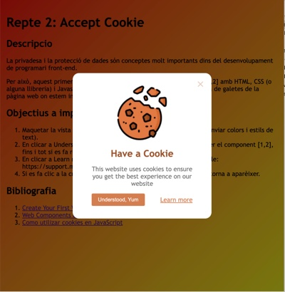

# Repte 2: Accept Cookie


## Description

Componente JS que crea un popup con la información sobre cookies




## Como utilizar

Archivos ncesarios:

- `cookie-pop-up.js`
- `scss/cookie-pop-up.scss`

Añadir el siguiente código al archivo que quiera que aparezca la información sobre la cookie.

```
<cookie-pop-up></cookie-pop-up>
<script src="./cookie-pop-up.js"></script>
```

Caso quieras modificar el texto del popup, modifique el archivo `cookie-pop-up.js`.

## Articulos utilizados

1. [Create Your First Web Component with Vanilla JavaScript](https://medium.com/tunaiku-tech/create-your-first-web-component-with-vanilla-javascript-af93cbf3a70f)
1. [Web Components Using Vanilla JS](https://mellowdevs.medium.com/web-components-using-vanilla-js-f7af00834caa)
1. [Como utilizar cookies en JavaScript](https://cybmeta.com/cookies-en-javascript)


## Some metrics

[](https://sonarcloud.io/summary/new_code?id=chaiben_repte-2-acceptCookie)
[](https://sonarcloud.io/summary/new_code?id=chaiben_repte-2-acceptCookie)
[](https://sonarcloud.io/summary/new_code?id=chaiben_repte-2-acceptCookie)

[](https://sonarcloud.io/summary/new_code?id=chaiben_repte-2-acceptCookie)
[](https://sonarcloud.io/summary/new_code?id=chaiben_repte-2-acceptCookie)
[](https://sonarcloud.io/summary/new_code?id=chaiben_repte-2-acceptCookie)

[](https://sonarcloud.io/summary/new_code?id=chaiben_repte-2-acceptCookie)